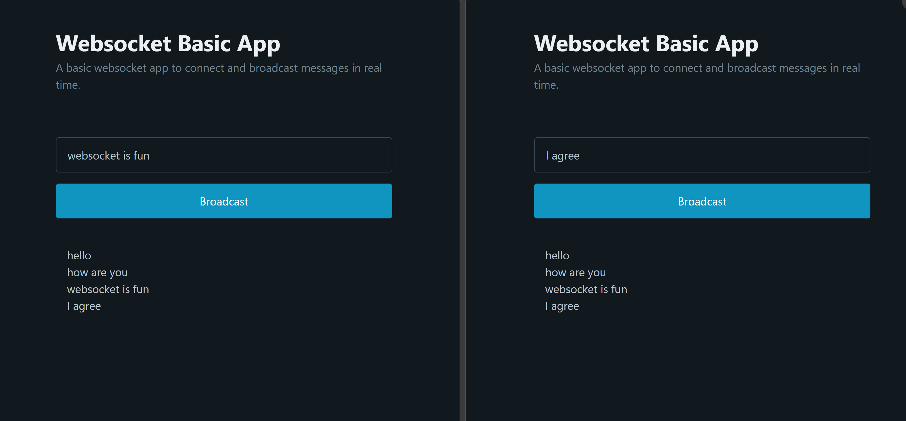

# Websocket Basic App
Node js basic Application using socket.io library to serve messages to multiple clients using websocket.

## Screenshot


## Pre-requisites
* Node.js

### Clone the repository

```
git clone [https://github.com/Viwarrior/websocket-impl-sample.git](https://github.com/Viwarrior/websocket-basic-app.git)
```

### Install dependencies

```
npm install socket.io
```


### Run the project

Start the server
```
cd server
node .
````
Open `client/public/index.html` in a browser to send requests
